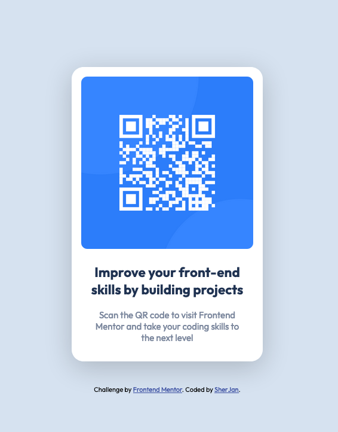

# Frontend Mentor - QR code component solution

This is a solution to the [QR code component challenge on Frontend Mentor](https://www.frontendmentor.io/challenges/qr-code-component-iux_sIO_H). Frontend Mentor challenges help you improve your coding skills by building realistic projects. 

## Table of contents

- [Overview](#overview)
  - [Screenshot](#screenshot)
  - [Links](#links)
- [My process](#my-process)
  - [Built with](#built-with)
  - [What I learned](#what-i-learned)
  - [Continued development](#continued-development)
  - [Useful resources](#useful-resources)
- [Author](#author)

<!-- **Note: Delete this note and update the table of contents based on what sections you keep.** -->

## Overview

### Screenshot

### Links

- Solution URL: [Add solution URL here](https://your-solution-url.com)
- Live Site URL: [Add live site URL here](https://your-live-site-url.com)

## My process

### Built with

- Semantic HTML5 markup
- CSS custom properties
- Flexbox
- Mobile-first workflow

### What I learned

Starting off the project completely thin air and trying to understand how to efficiently convert a given design into a complete web page felt daunting.

It took quite a while to figure out the basic structure of the html and figuring out wether to create multi-layered containers or making changes inside a div

The whole process of desiging and coding was a refresher considering even after cover intermediate CSS concepts and then actually putting the knowledge into use was quite a mental exercise  

Transition from Learning -> Building phase really got me stuck and in the process of building this simple componenet opened up my mind (alot of googling involved :P )

### Continued development

The most annoying thing as a beginner developer is figuring out how shorthands work and how it affects your design.

Quite alot of my time was spent figuring out why my qr-image wasn't shifting to the desired place even after using shorthands to manipulate the margins and padding.

More time has to be spend hands-on with CSS properties and how they affect your style sheets depending on how many division layers are being added.

More focus is needed on understanding these concepts
- Shorthands
- Understanding which layout model to used based on the project

### Useful resources

- [Mozilla Developer Network](https://developer.mozilla.org/en-US/) - Absolute life saver in every situation. Probably the only go-to resource for figuring out what the problem is.
- [Stack Overflow](https://stackoverflow.com/) - No hesitation using stack overflow - There is always someone having the same problem as me, gives me insight into where i went wrong with my code :p

## Author

- Website - [Add your name here](https://www.your-site.com)
- Frontend Mentor - [@sherySJ](https://www.frontendmentor.io/profile/SherSJ)
- LinkedIn - [sherjan909](https://www.linkedin.com/in/sherjan909/)

